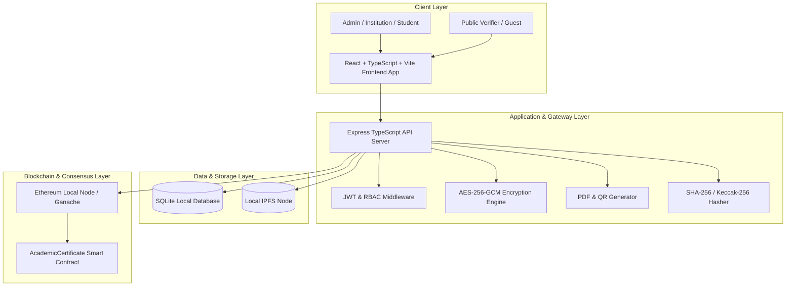
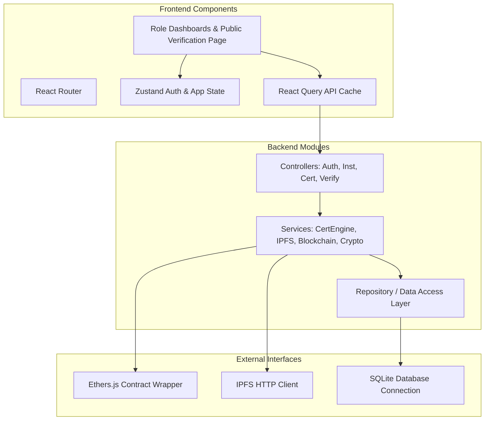
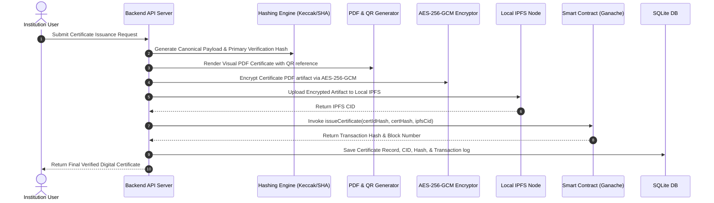
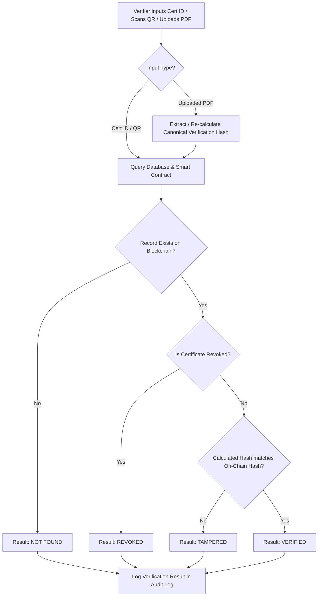

# Comprehensive System Architecture Specification

## Architectural Overview

The **Blockchain-Based Academic Certificate Verification & Digital Credential Management Platform** is a multi-tier, decentralized-backed platform engineered for immutable credential issuing and instant verification without central authority reliance.

### Layer Specifications

1. **Frontend Presentation Layer**:
   - Framework: React 18 with TypeScript & Vite.
   - Styling: Tailwind CSS & Lucide icons.
   - State Management: Zustand & React Query.
   - Responsiveness & Accessibility: Light/Dark mode, WCAG compliant contrast ratios.

2. **Backend Application Layer**:
   - Runtime: Node.js with Express & TypeScript.
   - Authentication & Access Control: JWT tokens, refresh tokens, role-based access control (ADMIN, INSTITUTION, STUDENT, VERIFIER, GUEST).
   - Security: AES-256-GCM artifact encryption, Helmet HTTP headers, CORS policies, rate limiting, request validation.

3. **Decentralized Storage Layer**:
   - Technology: Local IPFS node.
   - Purpose: Off-chain storage of encrypted PDF artifacts identified by cryptographic CIDs.

4. **Blockchain Immutable Ledger Layer**:
   - Smart Contract Language: Solidity 0.8.24 with OpenZeppelin AccessControl.
   - Execution Node: Hardhat / Ganache local Ethereum node.
   - Client Interop: Ethers.js v6.

5. **Local Persistence Layer**:
   - Technology: SQLite Database.
   - Purpose: Fast indexing of user profiles, institutions, audit logs, verification logs, and transaction status metadata.

## Core Diagrams

### System Architecture

### Component Architecture

### Certificate Issuance Workflow

### Verification Workflow

