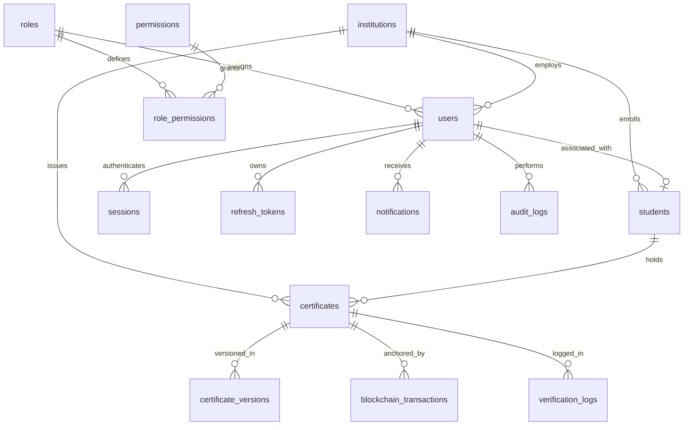

# SQLite Database Specification & Schema Architecture

The platform uses an embedded **SQLite** database configured with Write-Ahead Logging (`PRAGMA journal_mode = WAL;`) and Foreign Key enforcement (`PRAGMA foreign_keys = ON;`).

## Database Entity-Relationship Diagram



## Table Definitions

### 1. `roles`
System user role classifications.
- `id` (TEXT PRIMARY KEY): e.g. `'ADMIN'`, `'INSTITUTION'`, `'STUDENT'`, `'VERIFIER'`, `'GUEST'`
- `name` (TEXT NOT NULL UNIQUE)
- `description` (TEXT)

### 2. `permissions`
Granular authorization capabilities.
- `id` (TEXT PRIMARY KEY): e.g. `'cert:issue'`, `'cert:revoke'`, `'cert:verify'`, `'user:manage'`

### 3. `role_permissions`
Many-to-many junction between roles and permissions.

### 4. `institutions`
Verified educational entity issuers.
- `id` (TEXT PRIMARY KEY)
- `name` (TEXT NOT NULL)
- `code` (TEXT UNIQUE NOT NULL)
- `email` (TEXT UNIQUE NOT NULL)
- `wallet_address` (TEXT UNIQUE)
- `status` (TEXT DEFAULT 'ACTIVE')

### 5. `users`
System login accounts.
- `id` (TEXT PRIMARY KEY)
- `email` (TEXT UNIQUE NOT NULL)
- `password_hash` (TEXT NOT NULL)
- `role_id` (TEXT FK -> roles.id)
- `institution_id` (TEXT FK -> institutions.id, NULLABLE)

### 6. `students`
Student profile records.
- `student_identifier` (TEXT NOT NULL)
- `institution_id` (TEXT FK -> institutions.id)

### 7. `certificates`
Primary academic credentials table.
- `certificate_number` (TEXT UNIQUE NOT NULL)
- `canonical_hash` (TEXT UNIQUE NOT NULL) - SHA-256 primary identity hash
- `pdf_hash` (TEXT) - Rendered visual PDF hash
- `ipfs_cid` (TEXT) - Encrypted PDF CID on IPFS
- `status` (TEXT DEFAULT 'ISSUED')

### 8. `certificate_versions`
Audit trail of certificate amendments.

### 9. `blockchain_transactions`
State of Ethereum smart contract transactions.
- `tx_hash` (TEXT UNIQUE)
- `status` ('PENDING', 'SUBMITTED', 'CONFIRMED', 'FAILED', 'REVOKED')

### 10. `verification_logs`
Log of all verification requests and outcomes ('VERIFIED', 'TAMPERED', 'REVOKED', 'NOT_FOUND').

### 11. `audit_logs`
Security and administrative audit trail.

### 12. `notifications`
System alerts delivered to users.

### 13. `sessions`
Active session token management.

### 14. `refresh_tokens`
Secure hashed JWT refresh tokens.

### 15. `system_settings`
Global key-value configuration flags.

## Database Setup & One-Command Reset

```bash
# Reset database from clean state (Migration + Seeding)
npm run db:setup
```
